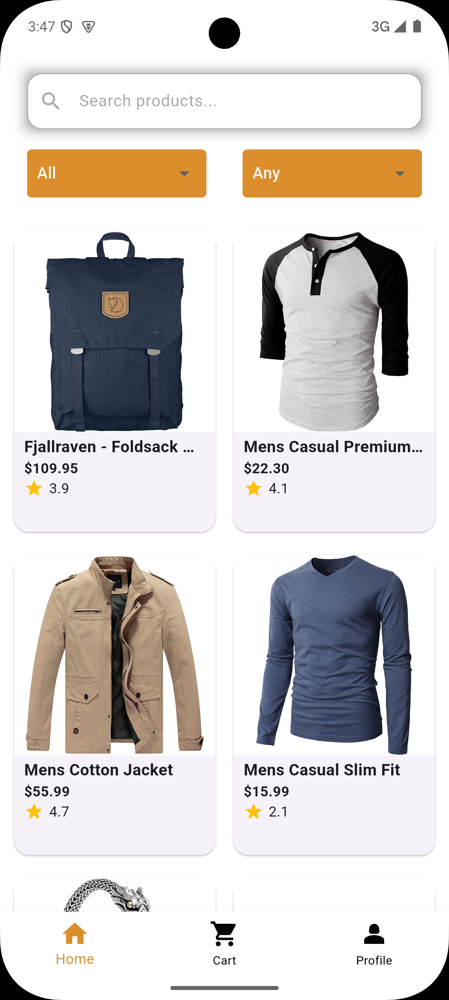

# EasyShop - Modern E-Commerce Mobile Application

EasyShop is a sophisticated and user-friendly e-commerce mobile application built with Flutter. It offers a seamless shopping experience with essential features like product browsing, detailed views, cart management, and user authentication.

## Features

### 🛍️ Product Management

- Browse products in a modern grid layout
- Detailed product views with images and descriptions
- Real-time product search functionality
- Category-based filtering (Electronics, Clothes)
- Price range filtering (< $50, > $100)

### 🔍 Smart Search

- Dedicated search screen for better user experience
- Real-time search results
- Search by product title or category
- Clean and intuitive search interface

### 🛒 Cart Management

- Add products to cart
- Adjust product quantities
- Real-time price calculation
- Remove items from cart
- Empty cart state handling

### 👤 User Experience

- Modern and clean UI design
- Smooth navigation
- Responsive layout
- Loading states and error handling
- Intuitive category and price filters

## Technical Stack

- **Framework**: Flutter
- **State Management**: Provider
- **API Integration**: FakeStore API
- **Dependencies**:
  - provider
  - http
  - json_annotation
  - flutter_native_splash
  - flutter_launcher_icons

## Getting Started

### Prerequisites

- Flutter SDK (^3.7.2)
- Dart SDK
- Android Studio / VS Code

### Installation

1. Clone the repository:

```bash
git clone https://github.com/NahumDm/easy-shop.git
```

2. Navigate to project directory:

```bash
cd easy-shop
```

3. Install dependencies:

```bash
flutter pub get
```

4. Run the app:

```bash
flutter run
```

## Screenshots

### Home Screen




### Product Detail


### Cart


## Contributing

1. Fork the repository
2. Create your feature branch (`git checkout -b feature/AmazingFeature`)
3. Commit your changes (`git commit -m 'Add some AmazingFeature'`)
4. Push to the branch (`git push origin feature/AmazingFeature`)
5. Open a Pull Request

## License

This project is licensed under the MIT License - see the [LICENSE](LICENSE) file for details.

## Acknowledgments

- Flutter team for the amazing framework
- FakeStore API for product data
- All contributors who have helped shape this project

## Contact

Project Link: [https://github.com/NahumDm/easy-shop](https://github.com/NahumDm/easy-shop)
